# SISTEMA DAVI RAPI — Especificación Funcional

> Documento funcional de negocio para la próxima versión del sistema. Describe **qué hace** cada módulo y **cómo se conecta** con los demás. No contiene referencias a código ni recomendaciones técnicas.

---

## 1. Propósito del sistema

DAVI RAPI es una plataforma integral para **negocios de comida rápida** con operación mixta (punto físico + domicilios). En una sola herramienta cubre:

- **Operación diaria**: registro y seguimiento de pedidos, asignación a repartidores, impresión de tickets.
- **Inventario**: control de insumos por receta, descuento automático del stock al vender, ajustes manuales.
- **Finanzas**: gastos del día, cuentas por cobrar (fiados), abonos parciales, cierre de caja diario con cuadre.
- **Administración**: multi-empresa, sucursales, usuarios y roles.
- **Análisis**: dashboard con métricas en tiempo real y rangos de fecha.

El sistema está pensado para que un negocio pueda llevar todas sus operaciones, dinero y métricas desde un único lugar, con varios negocios/sucursales conviviendo de forma aislada.

---

## 2. Vista general del sistema

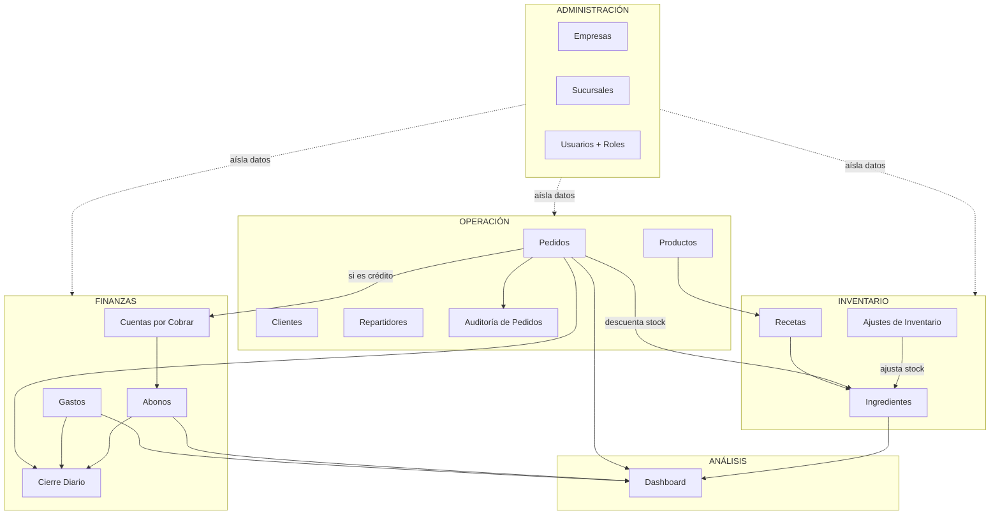

**Lectura del diagrama:** la administración define quién ve qué (aísla datos por empresa). La operación gira alrededor de los pedidos, que tocan inventario (vía recetas) y finanzas (vía crédito). El cierre diario consolida lo que entró (ventas + abonos) y lo que salió (gastos). El dashboard observa todo.

---

## 3. Roles y control de acceso

El sistema reconoce cuatro perfiles, ordenados de mayor a menor alcance:

| Rol | Alcance | Para qué se usa |
|---|---|---|
| **SuperAdmin** | Global (todas las empresas) | Crear empresas, gestionar la plataforma, soporte. |
| **Admin de empresa** | Una empresa completa (todas sus sucursales) | Gestiona usuarios, productos, finanzas, ve todo de su negocio. |
| **Staff** | Operación de su empresa | Toma pedidos, gestiona inventario, registra gastos, hace cierre de caja. Puede eliminar (queda auditado). |
| **Repartidor** | Solo lo suyo | Ve únicamente sus entregas, sus ganancias por envío y sus pendientes. |

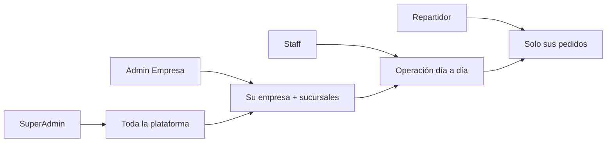

**Reglas clave:**
- Los módulos de **Empresas, Usuarios y Auditoría de Pedidos** solo los ven Admin/SuperAdmin.
- **Staff** accede a operación, inventario y finanzas de su empresa, pero no a la administración del sistema.
- **Repartidor** solo accede al Dashboard (versión reducida) y a Pedidos (filtrado a los suyos).
- Cualquier acción de **eliminar** está bloqueada para roles que no sean Admin o Staff, y queda registrada en auditoría cuando aplica.

---

## 4. Multi-empresa (aislamiento de datos)

El sistema permite que varias empresas operen sobre la misma instalación sin verse entre sí.

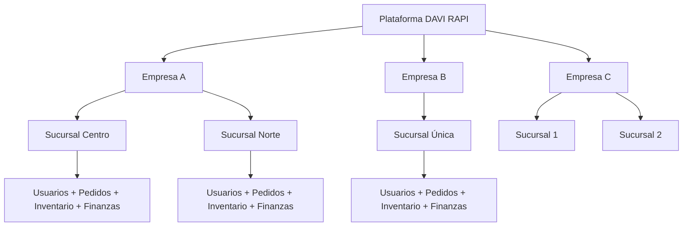

**Cómo funciona el aislamiento:**
- Cada registro operativo (pedido, producto, ingrediente, gasto, etc.) pertenece a una empresa y, opcionalmente, a una sucursal.
- Un usuario normal solo ve los datos de su empresa.
- El **SuperAdmin** ve todo, lo que le permite dar soporte y administrar el sistema globalmente.
- Cuando un usuario crea un registro, este se asigna automáticamente a su empresa sin que tenga que elegirla.

---

## 5. Módulo: Autenticación

**Objetivo:** controlar quién entra al sistema y bloquear intentos maliciosos.

**Funcionalidades:**
- Login con usuario y contraseña.
- Cierre de sesión.
- **Protección contra fuerza bruta**: tras 5 intentos fallidos consecutivos, la cuenta queda bloqueada 15 minutos.
- Mensaje de intentos restantes para guiar al usuario legítimo.
- Tras un login exitoso, se reinicia el contador de fallos.

**Flujo de inicio de sesión:**

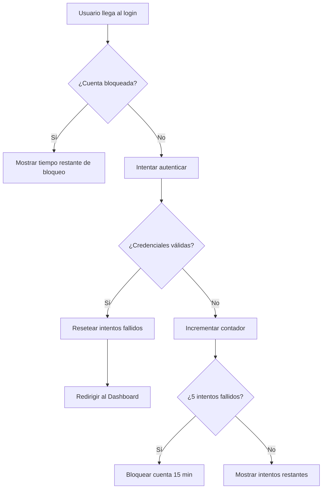

---

## 6. Módulo: Productos (Menú)

**Objetivo:** mantener el catálogo de productos que se venden.

**Atributos del producto:**
- Nombre, precio, descripción, imagen.
- Estado: disponible / no disponible (un producto desactivado no se vende).

**Funcionalidades:**
- Crear, editar, eliminar productos.
- Subir imagen del producto.
- Activar/desactivar disponibilidad sin eliminar el registro.
- Cada producto puede tener una **receta** (ver módulo Recetas) que define qué insumos consume al venderse.

**Reglas de negocio:**
- No se puede eliminar un producto que ya tiene ventas asociadas (se debe desactivar en su lugar).
- El precio debe ser numérico y mayor a cero.

---

## 7. Módulo: Clientes

**Objetivo:** mantener un directorio de clientes recurrentes para acelerar la toma de pedidos y soportar el crédito.

**Atributos:**
- Nombre completo, teléfono, dirección.

**Funcionalidades:**
- Registrar, editar, eliminar clientes.
- Listado de clientes históricos.
- **Auto-creación**: cuando se hace una venta a Crédito y el teléfono ingresado no existe, el cliente se crea automáticamente.

**Conexión con otros módulos:**
- Toda **Cuenta por Cobrar** está vinculada a un cliente.
- En el formulario de pedido, los nombres y teléfonos se autocompletan desde aquí.

---

## 8. Módulo: Repartidores

**Objetivo:** gestionar al personal que entrega los domicilios.

**Atributos:**
- Nombre, apellido, teléfono.

**Funcionalidades:**
- Registrar, editar, eliminar repartidores.
- Asignar repartidores a pedidos de tipo domicilio.
- Un repartidor puede estar **vinculado a un usuario del sistema** (rol "repartidor"), lo que le permite iniciar sesión y ver únicamente sus entregas.

**Conexión con otros módulos:**
- Cada pedido a domicilio referencia a un repartidor.
- El **Dashboard** calcula el ranking de repartidores por número de entregas y monto generado.
- El repartidor recibe sus ganancias en función del **costo de envío** acumulado de los pedidos entregados.

---

## 9. Módulo: Pedidos (Ventas)

**Objetivo:** registrar y dar seguimiento a todas las ventas del negocio. Es el corazón operativo del sistema.

### 9.1 Atributos del pedido

- **Cliente**: nombre, teléfono, dirección (opcional).
- **Tipo**: local (en el punto físico) o domicilio.
- **Repartidor**: solo si es domicilio.
- **Costo de envío**: aplica solo a domicilios.
- **Producto y cantidad** (un pedido puede tener varios productos — se llama "pedido multi-producto").
- **Método de pago**: Efectivo, Nequi, Daviplata, Cuenta/Transferencia, Crédito (fiado).
- **Estado**: recibido → preparando → en camino → entregado, o cancelado.
- **Identificador de grupo**: cuando un pedido tiene varios productos, todos comparten un mismo identificador para tratarse como una sola transacción.

### 9.2 Cálculo del total

Para cada línea de producto:
```
total_línea = (precio_producto × cantidad) + costo_envío
```
El costo de envío se aplica una sola vez al pedido completo (en la primera línea del grupo), no por cada producto.

### 9.3 Flujo de creación de un pedido

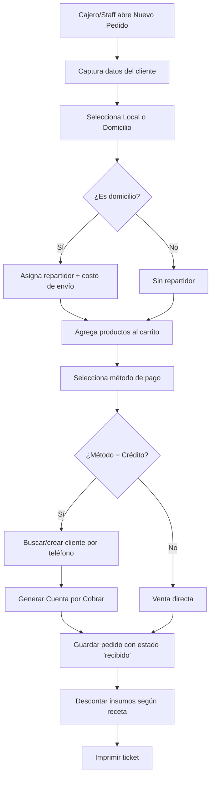

### 9.4 Ciclo de vida del estado del pedido

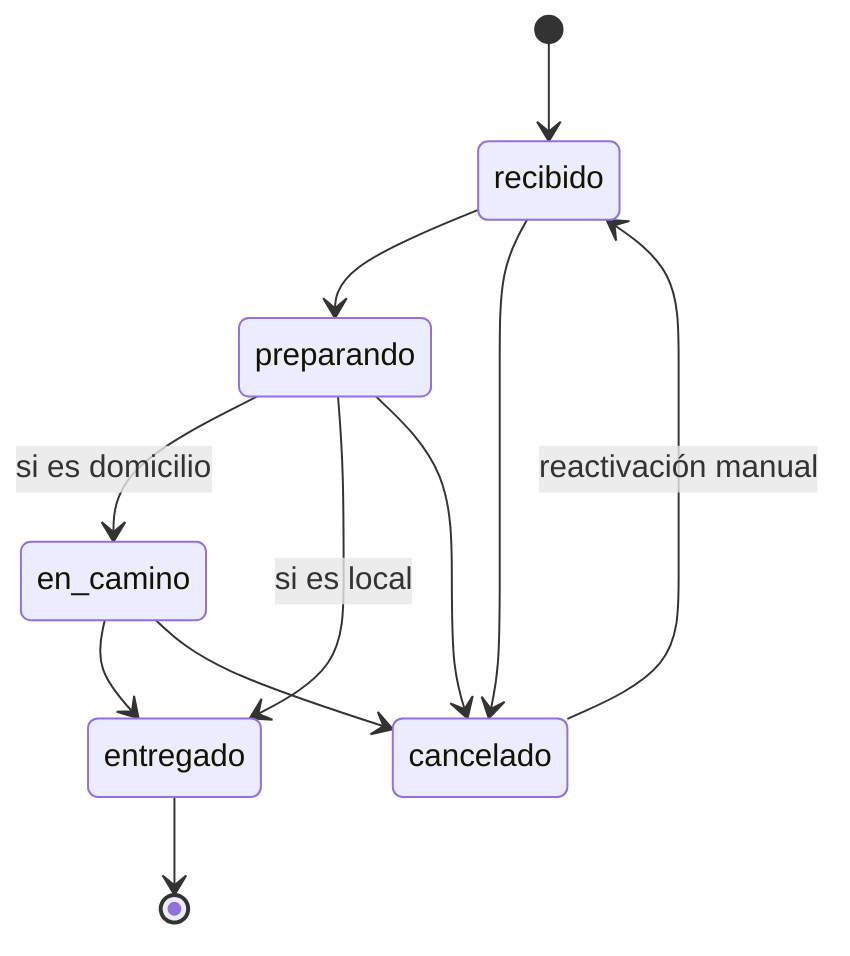

### 9.5 Reglas de negocio de pedidos

- Un pedido a **domicilio obliga** a tener repartidor; un pedido **local** no.
- Si el método de pago es **Crédito**, el total no entra como ingreso real hasta que se abone (ver Cuentas por Cobrar).
- Cuando un pedido pasa a **entregado**, queda registrada la fecha/hora de entrega.
- Cuando un pedido se **cancela**, el inventario se restaura automáticamente.
- Si un pedido cancelado se **reactiva**, el inventario se vuelve a descontar.
- Si un pedido se **edita** (cambia producto o cantidad), el sistema restaura los insumos antiguos y descuenta los nuevos.
- Un pedido **multi-producto** se gestiona como un grupo: cambiar el estado actualiza todos los productos del grupo a la vez.
- Los pedidos **cancelados** se ocultan del listado por defecto y no cuentan en métricas.
- Toda edición, cambio de estado o eliminación queda registrada en la **Auditoría de Pedidos**.

### 9.6 Impresión de tickets

- **Ticket individual**: por una línea de producto.
- **Ticket grupal**: por todo el pedido multi-producto, con el desglose y el total consolidado.
- El ticket muestra los datos de la empresa (logo, NIT, dirección, teléfono).

---

## 10. Módulo: Auditoría de Pedidos (OrderLogs)

**Objetivo:** dejar huella de **toda modificación** sobre un pedido para tener trazabilidad y resolver disputas.

**Qué se registra automáticamente:**
- Cambio de estado (de "recibido" a "entregado", etc.).
- Cambio de producto, cantidad, tipo, costo de envío, cliente o método de pago.
- Cancelación de pedido (con autor y fecha).
- Eliminación definitiva del pedido (queda el log incluso después de borrar).

**Información en cada entrada:**
- Pedido afectado.
- Usuario que hizo el cambio.
- Detalle textual del cambio (ej. "Estado: de 'preparando' a 'entregado' por jhon").
- Fecha/hora exacta.

**Acceso:** solo Admin/SuperAdmin pueden consultar la auditoría.

---

## 11. Módulo: Ingredientes (Insumos)

**Objetivo:** llevar el control del stock de materias primas que se consumen al producir.

**Atributos del ingrediente:**
- Nombre (único por empresa), unidad de medida (gr, ml, unidad, etc.), stock actual, costo unitario.

**Funcionalidades:**
- Crear, editar, eliminar ingredientes.
- Visualizar stock y costo.
- Al eliminar un ingrediente, el sistema también elimina sus referencias en recetas y su historial de ajustes.

**Conexión con otros módulos:**
- Las **Recetas** los enlazan con los productos.
- Los **Pedidos** descuentan stock automáticamente vía la receta.
- Los **Ajustes de Inventario** suman o restan stock manualmente.
- El **Dashboard** muestra alertas de stock bajo (≤ 5 unidades).

---

## 12. Módulo: Recetas (ProductIngredients)

**Objetivo:** definir la "fórmula" de cada producto — qué insumos consume y en qué cantidad.

**Estructura:**
- Cada línea de receta = un producto + un ingrediente + cantidad requerida por unidad de producto.
- Un producto puede tener muchos ingredientes; un ingrediente puede estar en muchos productos.

**Funcionalidades:**
- Pantalla de receta por producto: añadir ingredientes con su cantidad.
- Eliminar ingredientes de la receta.
- Al añadir un ingrediente a la receta, se puede actualizar **el costo del insumo** en la misma operación (útil para mantener costos al día).

**Conexión central:** la receta es lo que conecta el mundo de **ventas** con el mundo de **inventario** y permite calcular el **costo real** de cada producto vendido.

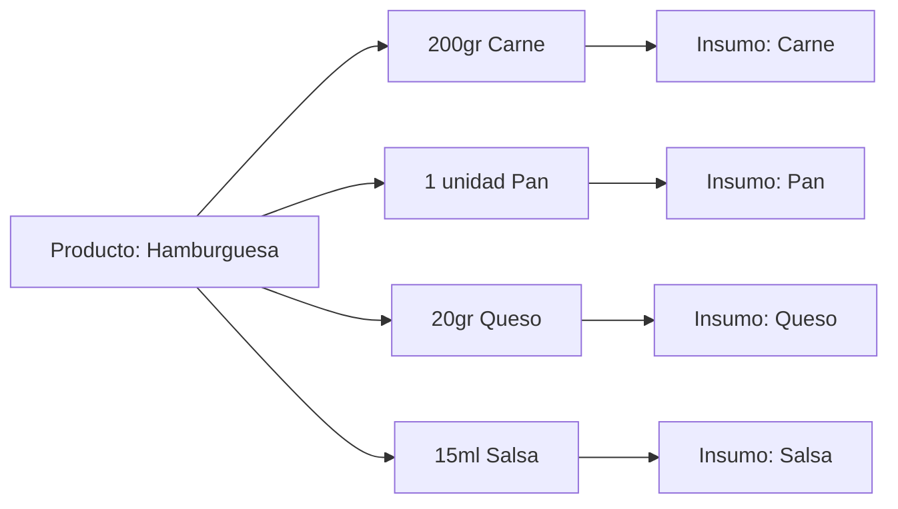

---

## 13. Módulo: Ajustes de Inventario

**Objetivo:** corregir el stock por motivos que no son ventas (mermas, devoluciones, compras de insumo, daños, robos).

**Atributos del ajuste:**
- Ingrediente afectado.
- Tipo: **entrada** (suma stock) o **baja** (resta stock).
- Cantidad ajustada.
- Motivo (obligatorio): ej. "compra a proveedor", "merma", "daño", "conteo físico".
- Observaciones (opcional).
- Fecha y autor.

**Funcionalidades:**
- Listado histórico de ajustes (con qué pasó, cuánto y por qué).
- Registrar nuevo ajuste — al guardar, el stock del ingrediente se actualiza al instante.
- Eliminar un ajuste también revierte su impacto en el stock.

**Flujo:**

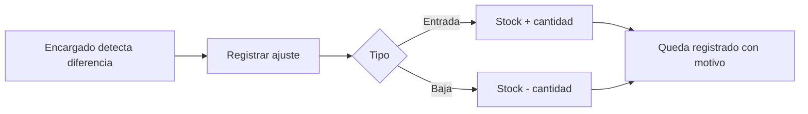

---

## 14. Flujo integrado: Pedido → Inventario → Finanzas

Este es el flujo más importante del sistema porque conecta los tres núcleos.

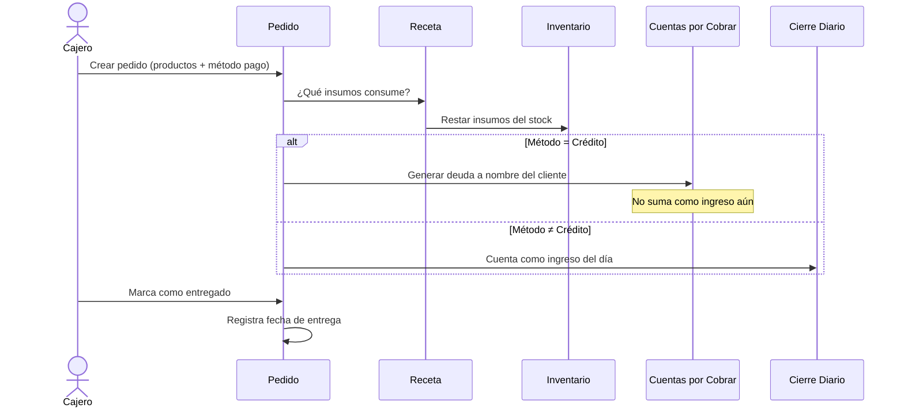

---

## 15. Módulo: Gastos

**Objetivo:** registrar todas las salidas de dinero del negocio para que el cierre diario y el dashboard reflejen la realidad.

**Atributos:**
- Descripción, monto, fecha.

**Funcionalidades:**
- Listar gastos ordenados por fecha.
- Registrar nuevo gasto (rápido, un solo formulario).
- Eliminar gasto.

**Conexión con otros módulos:**
- Los gastos del día se restan en el **Cierre Diario**.
- El **Dashboard** los muestra como total y los descuenta de la utilidad neta.

**Reglas:**
- Los montos deben ser positivos.
- Los gastos no se asignan a un pedido específico — son egresos generales del negocio.

---

## 16. Módulo: Cuentas por Cobrar (Crédito / Fiado)

**Objetivo:** gestionar las ventas a crédito ("fiados") y su recuperación mediante abonos parciales.

**Cómo nace una cuenta por cobrar:**
- Automáticamente, cuando se hace un pedido con método de pago **Crédito**.
- Manualmente, registrando una deuda directa a un cliente.

**Atributos:**
- Cliente deudor.
- Pedido asociado (si nació de una venta).
- Monto total adeudado.
- Descripción.
- Estado: **pendiente** o **pagado**.

**Funcionalidades:**
- Listado priorizado: primero las pendientes, luego las pagadas.
- Crear deuda manual.
- Registrar **abonos parciales** (ver siguiente módulo).
- Marcar como pagada manualmente.
- Eliminar la cuenta (queda registro).

**Flujo de recuperación:**

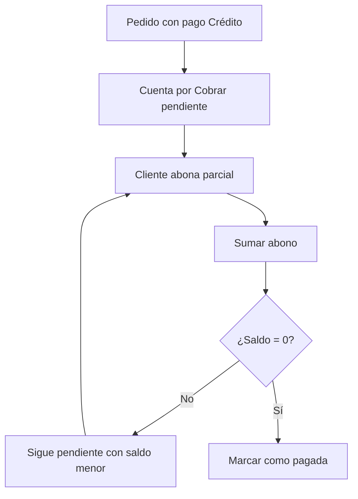

**Regla clave:** la venta a crédito **no cuenta como ingreso real** hasta que el cliente abona. Lo que cuenta como ingreso es el **abono**, no la venta.

---

## 17. Módulo: Abonos a Cuentas (AccountPayments)

**Objetivo:** registrar pagos parciales sobre una cuenta por cobrar.

**Atributos:**
- Cuenta a la que se abona.
- Monto del abono.
- Método de pago (Efectivo, Nequi, Daviplata, etc.).
- Fecha (automática) y observaciones.

**Comportamiento automático:**
- Al guardar un abono, el sistema suma todos los abonos previos de esa cuenta.
- Si el total abonado **iguala o supera** la deuda, la cuenta cambia automáticamente a **pagada**.
- Si no, queda como **pendiente** con saldo restante.

**Conexión:**
- Los abonos del día son **ingresos reales** y entran al cierre diario y al dashboard.
- Aparecen desglosados por método de pago en el resumen financiero.

---

## 18. Módulo: Cierre Diario de Caja

**Objetivo:** al final del día, cuadrar lo que el sistema esperaba en caja contra lo que realmente hay (conteo físico).

**Cálculo del esperado:**
```
Ingresos del día  = Ventas no-crédito del día + Abonos recibidos hoy
Salidas del día   = Gastos registrados hoy
Esperado neto     = Ingresos del día - Salidas del día
```

**Datos del cierre:**
- Fecha del cierre.
- Base inicial (caja con la que se arrancó el día).
- Monto esperado (calculado).
- Monto real (lo que se contó físicamente).
- Diferencia: real − esperado (positiva = sobrante, negativa = faltante).
- Observaciones.

**Flujo:**

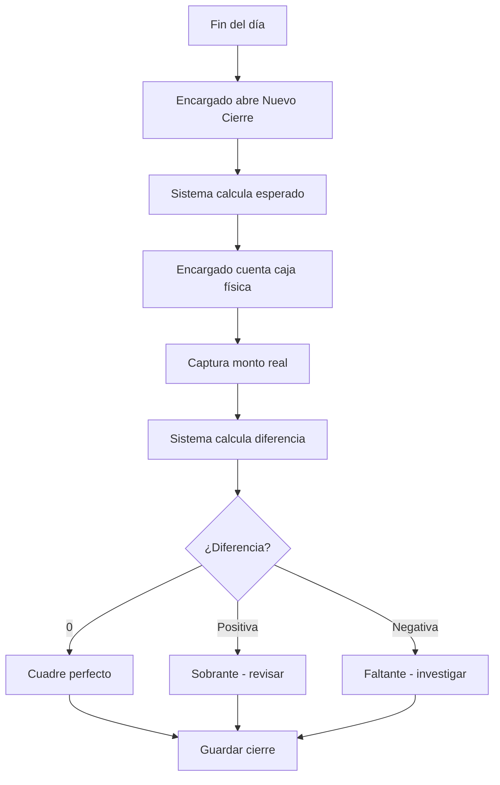

**Importancia del módulo:** es la herramienta de control de caja del dueño. Sin esto, no hay forma de detectar errores de cobro, pérdidas u olvidos de registro.

---

## 19. Módulo: Empresas y Sucursales

**Objetivo:** organizar la plataforma cuando hay múltiples negocios o múltiples puntos físicos de un mismo negocio.

### Empresa
- Datos básicos: nombre, NIT, dirección, teléfono, correo, logo.
- Marca de "tiene sucursales" (sí/no).
- Aparece en los tickets impresos como datos del local.

### Sucursal
- Pertenece a una empresa.
- Tiene su propia dirección/teléfono.
- Permite que una empresa con varios puntos pueda separar pedidos, inventarios y cierres por punto físico.

**Quién las gestiona:**
- **Empresas**: solo SuperAdmin.
- **Sucursales**: el Admin de la empresa puede crear las suyas.

**Filtro en el dashboard:** un Admin puede filtrar las métricas por sucursal específica.

---

## 20. Módulo: Usuarios

**Objetivo:** gestionar quién entra al sistema y con qué permisos.

**Atributos:**
- Usuario, contraseña, rol.
- Empresa y sucursal a la que pertenece (no aplica a SuperAdmin).
- Si el rol es "repartidor", se vincula al **registro de repartidor** correspondiente.
- Contadores de seguridad: intentos fallidos, hora de bloqueo.

**Reglas:**
- Si el rol es **admin global** (SuperAdmin), no se le asigna empresa — ve todo.
- Si el rol es cualquier otro, **debe** seleccionar empresa.
- Solo Admin/SuperAdmin pueden crear, editar o eliminar usuarios.
- El usuario "admin" siempre se trata como SuperAdmin por compatibilidad.

---

## 21. Módulo: Dashboard

**Objetivo:** ofrecer una vista única y filtrable del estado del negocio.

### 21.1 Dashboard del Repartidor (vista reducida)

Solo muestra:
- **Entregas en el período**: número de pedidos que ha entregado.
- **Ganancia del período**: suma de los costos de envío de sus pedidos entregados.
- **Pendientes hoy**: pedidos asignados que aún no se entregan ni cancelan.
- Botón directo a "Mis entregas".

### 21.2 Dashboard del Admin / Staff (vista completa)

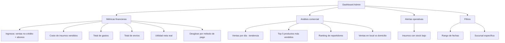

### 21.3 Cálculos clave del dashboard

| Métrica | Cómo se calcula |
|---|---|
| Ingresos | Ventas que no son crédito + Abonos recibidos en el período. |
| Costo de insumos vendidos | Suma del costo de cada ingrediente consumido por los productos vendidos. |
| Total envíos | Suma de costos de envío de todos los pedidos del período. |
| Total gastos | Suma de gastos del período. |
| **Utilidad neta** | Ingresos − Envíos − Costo de insumos − Gastos. |
| Pedidos contados | Se cuenta cada pedido multi-producto como **una sola transacción**, no por cada línea. |

### 21.4 Filtros

- **Rango de fechas**: todas las métricas se recalculan según el rango (por defecto, todo el histórico).
- **Sucursal**: para empresas con varias sucursales, se puede aislar la vista.

### 21.5 Reglas

- Los pedidos **cancelados** se excluyen de **todas** las métricas.
- El crédito (fiado) **no cuenta como ingreso** hasta que se abone — el dashboard refleja flujo de caja real, no facturación bruta.

---

## 22. Mapa completo de relaciones entre módulos

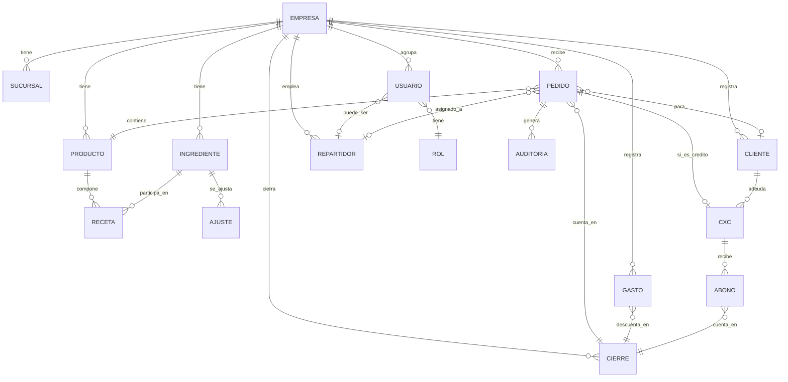

---

## 23. Reglas globales de negocio

### Sobre dinero
1. El crédito (fiado) **no es ingreso** hasta que se abona.
2. Los abonos del día sí son ingreso real.
3. Los gastos siempre son positivos y restan del balance.
4. La utilidad real = ingresos efectivos − envíos − costo de insumos − gastos.
5. El cierre diario debe cuadrar entre lo esperado por el sistema y el conteo físico.

### Sobre inventario
1. Vender un producto descuenta automáticamente sus insumos según la receta.
2. Cancelar un pedido restaura los insumos.
3. Editar un pedido restaura los insumos viejos y descuenta los nuevos.
4. Si un producto no tiene receta, no se hace movimiento de inventario al venderlo.
5. Los ajustes manuales registran el motivo siempre.

### Sobre operación
1. Domicilio sin repartidor no es válido.
2. Local no requiere repartidor ni dirección.
3. Un pedido cancelado no aparece en el listado por defecto ni en métricas.
4. Toda modificación a un pedido queda en auditoría con autor y momento.
5. Pedidos multi-producto se manejan como una sola transacción a efectos de estado, ticket y conteo.

### Sobre acceso
1. Cada usuario solo ve datos de su empresa, salvo SuperAdmin.
2. Eliminar registros está restringido a Admin y Staff.
3. La administración de empresas, usuarios y auditoría es exclusiva de Admin.
4. El repartidor solo ve sus pedidos y sus métricas.

---

## 24. Glosario rápido

| Término | Significado en el sistema |
|---|---|
| **Pedido / Venta** | Una transacción de uno o varios productos, con o sin domicilio. |
| **Pedido grupo** | Pedido con varios productos, manejado como una única transacción. |
| **Local** | Venta en el punto físico, sin domicilio. |
| **Domicilio** | Venta con entrega a la dirección del cliente, requiere repartidor y costo de envío. |
| **Crédito / Fiado** | Venta sin pago inmediato; genera una cuenta por cobrar. |
| **Abono** | Pago parcial sobre una deuda. |
| **Cierre diario** | Cuadre de caja al final del día. |
| **Receta** | Lista de insumos que consume un producto. |
| **Ajuste de inventario** | Movimiento manual de stock (entrada o baja) con motivo. |
| **Stock bajo** | Insumo con 5 unidades o menos. |
| **Ranking de repartidores** | Repartidores ordenados por número de entregas y monto generado. |
| **Empresa** | Negocio independiente dentro de la plataforma. |
| **Sucursal** | Punto físico de una empresa. |
| **Auditoría** | Bitácora inmutable de cambios sobre pedidos. |

---

## 25. Resumen ejecutivo en una página

DAVI RAPI es la plataforma diaria de un negocio de comida rápida. Un cajero registra un **pedido** indicando productos, cliente y método de pago; el sistema **descuenta los insumos** automáticamente según la **receta** de cada producto. Si el pago es a **crédito**, se crea una **cuenta por cobrar** que el cliente irá pagando con **abonos**; mientras tanto no cuenta como ingreso real. Si el pedido es a **domicilio**, se asigna un **repartidor** con un **costo de envío** que él gana al entregar.

Al final del día, el encargado hace el **cierre diario**: el sistema calcula lo que debería haber en caja sumando ventas no-crédito y abonos del día, restando los **gastos**; el encargado cuenta físicamente y registra la **diferencia**.

El **dashboard** muestra en tiempo real ingresos, gastos, utilidad real, ranking de repartidores, productos más vendidos y alertas de stock. Toda **modificación de pedido queda auditada**.

La plataforma soporta **múltiples empresas y sucursales** aisladas entre sí, con cuatro roles (SuperAdmin, Admin, Staff, Repartidor) que ven sólo lo que les corresponde.
